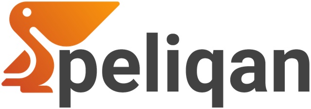
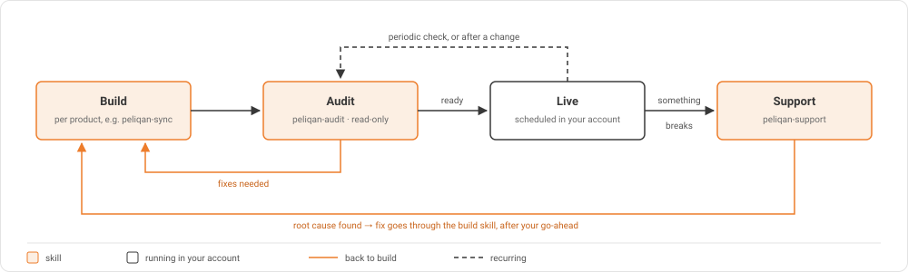

<p align="center">
  <a href="https://peliqan.io">
    <picture>
      <source media="(prefers-color-scheme: dark)" srcset="docs/images/peliqan-logo-dark.png">
      
    </picture>
  </a>
</p>

<h1 align="center">Peliqan Skills</h1>

<p align="center">
  <em>Describe what you need. AI builds it on your Peliqan account, checks it, and helps when something breaks.</em>
</p>

<p align="center">
  <a href="https://peliqan.io"></a>
  
  
</p>

<p align="center">
  <strong>Build &middot; Audit &middot; Support</strong><br>
  <sub>The same patterns our own team uses in production, packaged as skills for AI agents</sub>
</p>

---

Peliqan Skills teach AI agents how to work on your [Peliqan](https://peliqan.io) account the way we do. The AI talks to your account through the Peliqan MCP server: it inspects connections and tables, builds and deploys, and reads run logs. Anything that writes to your account waits for your go-ahead.

## Installation

**Claude app:** Settings → Plugins → **Add marketplace** → `https://github.com/Peliqan-io/skills`, then install **peliqan**.

**Claude Code:** send these one at a time:

```
/plugin marketplace add Peliqan-io/skills
/plugin install peliqan@peliqan
```

One plugin gives you every skill and the Peliqan MCP server. The first time a skill uses the MCP, you sign in with your Peliqan account.

No plugins, the MCP server by hand, or checking that it works: see [INSTALL.md](INSTALL.md).

## Frameworks 

Proven patterns for what you build on Peliqan. AI builds, audits and supports each one with its own skills.

| Framework | What you get | Docs |
|---|---|---|
| **Syncs** | Keep two systems in sync (orders, stock, customers…), API to API, or reading from your warehouse. One worker per system pair, no duplicates, nothing lost silently, code you own. | [docs/syncs](docs/syncs/README.md) |
| **Dashboards** | Dashboards on your warehouse: rebuild a report from any BI tool (Power BI, Tableau, Excel…), start from scratch, or build on tables you already have. The data model scales from one view to a full Bronze/Silver/Gold architecture, and every number is verified on real records before anything is built. | [docs/dashboards](docs/dashboards/README.md) |

More frameworks will be added the same way, each with its own build skill and docs.

## Skills 

| Skill | Command | What it does |
|---|---|---|
| [`peliqan-sync`](skills/peliqan-sync) | `/peliqan:peliqan-sync` | **Build** a sync worker for a system pair, or add a sync to an existing one. Tests, deploys and verifies it. |
| [`peliqan-dashboard`](skills/peliqan-dashboard) | `/peliqan:peliqan-dashboard` | **Build** a dashboard: from an existing report in any BI tool, from scratch, or on existing tables. Sets up the data model, verifies every number on real data, then builds and documents it. |
| [`peliqan-audit`](skills/peliqan-audit) | `/peliqan:peliqan-audit` | **Audit** something that looks healthy, before go-live or after a change. Returns a pass/warn/fail scorecard and a ranked fix list. Read-only. |
| [`peliqan-support`](skills/peliqan-support) | `/peliqan:peliqan-support` | **Support** when something is broken anywhere in your account: a sync, a pipeline, a data app, an API endpoint, a stale table. Finds the root cause and proposes a fix. Changes nothing without your go-ahead. |
| [`peliqan-help`](skills/peliqan-help) | `/peliqan:peliqan-help` | Quick reference for all of the above. |

One install gives you all of them. The commands above are the plugin form; with a manual install or on claude.ai they are `/peliqan-sync` and so on. You don't have to remember them either: describe what you want ("rebuild this Power BI report", "is our order sync ready to go live?", "the pipeline failed last night") and the AI picks the right skill.

## How they fit together

Every framework follows the same lifecycle. Each framework has its own build skill; audit and support are shared and know every framework.

<p align="center">
  
</p>

## Repository layout

```
INSTALL.md                   # other install setups
.claude-plugin/              # plugin manifest: one install for everything
.mcp.json                    # bundles the Peliqan MCP server
docs/
├── README.md                # how the docs are organised, diagram style
├── images/                  # logo and shared diagrams
├── dashboards/              # one folder per framework
└── syncs/
skills/
├── peliqan-help/            # quick reference
├── peliqan-audit/           # SKILL.md + references/<framework>.md
├── peliqan-support/         # SKILL.md + references/<framework>.md
├── peliqan-dashboard/       # build skill for dashboards: data model, formula checks, Streamlit patterns
└── peliqan-sync/            # build skill for syncs: framework, template, system notes, tests
```

---

<p align="center">
  <sub>Built and maintained by the <a href="https://peliqan.io">Peliqan</a> team. Questions, or help getting started: ask your Peliqan contact, or reach us through <a href="https://peliqan.io">peliqan.io</a>.</sub>
</p>
