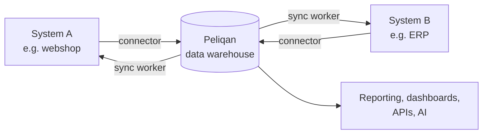
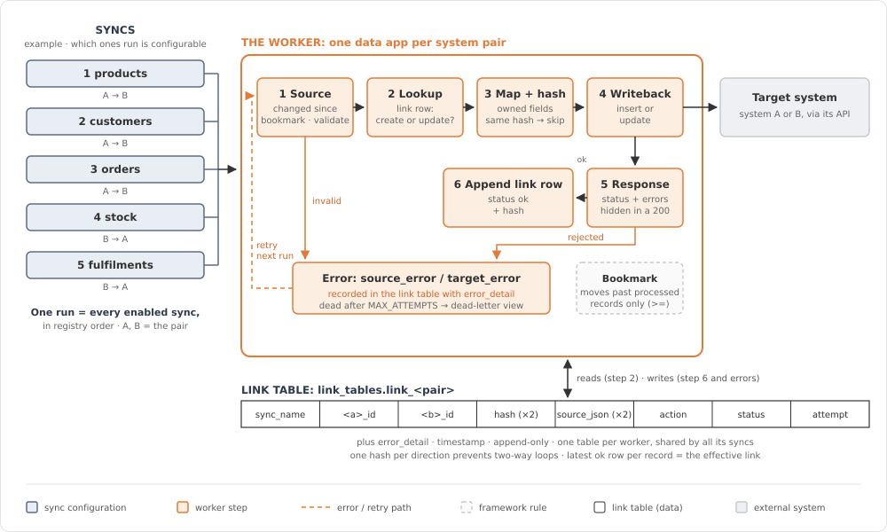
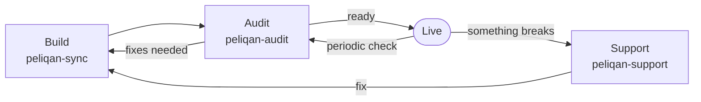

<h1 align="center">Peliqan Skills</h1>

<p align="center">
  <em>You describe the sync. Claude builds it, audits it and keeps it running on your Peliqan account.</em>
</p>

<p align="center">
  
  
  
  
</p>

<p align="center">
  <strong>Build &middot; Audit &middot; Support</strong><br>
  <sub>One worker per system pair &middot; no duplicates &middot; nothing lost silently &middot; code you own</sub>
</p>

---

Skills that let Claude build on your [Peliqan](https://peliqan.io) account for you, with the same patterns our own team uses in production.

### Before / after

You want every new webshop order to show up in your ERP as a sales order.

**Without the skill:** someone writes API calls, invents their own way to remember what was already sent, finds the duplicates a week later and wonders why three orders never arrived.

**With the skill:**

> Add an order sync from the webshop to the ERP: sales order with order lines, customer as contact.

Claude inspects your account, writes the sync on a proven framework, tests it offline, deploys it, runs a limited test and proves on a second run that nothing gets written twice. Every order it touches is traceable in your warehouse.

## Skills

| Skill | Command | What it does |
|---|---|---|
| [`peliqan-sync`](skills/peliqan-sync) | `/peliqan-sync` | **Build.** Sets up a sync worker between two business systems (for example a webshop and an ERP) as one Peliqan data app, or adds a sync (orders, stock, customers, fulfilment, refunds…) to a worker you already have. |
| [`peliqan-audit`](skills/peliqan-audit) | `/peliqan-audit` | **Audit.** Checks something that looks healthy against its rules and run history, before go-live or after a change. Today: sync workers. Returns a pass/warn/fail scorecard and a ranked fix list. Read-only. |
| [`peliqan-support`](skills/peliqan-support) | `/peliqan-support` | **Support.** Something is broken anywhere in your account: a sync, a pipeline, a data app, an API endpoint, a stale table. Finds the root cause from the logs and data and proposes a fix. Changes nothing without your go-ahead. |
| [`peliqan-help`](skills/peliqan-help) | `/peliqan-help` | Quick reference for all of the above. |

One install gives you all four. You don't have to remember the commands either: describe what you want ("is our order sync ready to go live?", "orders stopped arriving in the ERP") and Claude picks the right skill.

More skills will be added here over time.

Want to know why you can trust it: requirements, risks and guards, QA? Read the [technical overview](docs/technical-overview.md).

**On this page**

1. [What the skill builds](#1-what-the-skill-builds)
2. [How a sync worker works](#2-how-a-sync-worker-works)
3. [Building a sync](#3-building-a-sync)
4. [Auditing and support](#4-auditing-and-support)
5. [Installation](#5-installation)
6. [Repository layout](#6-repository-layout)

---

## 1. What the skill builds

The skill builds **sync workers**: Peliqan data apps that read from your data warehouse and write records into a business system, such as creating a sales order in your ERP for each new webshop order. The warehouse sits in the middle, so the worker reads clean tables and keeps all its state next to your data:



Every worker the skill generates follows these principles:

| Principle | What it means for you |
|---|---|
| **The warehouse is the hub** | All data and all sync state live in one place. The same data feeds your syncs, your reporting and your APIs. |
| **Every write is traceable** | Each record written to a target is logged in a *link table*: which source record, which target record, when, and with what result. You can always answer "where did this order go?" with SQL. |
| **Idempotent by design** | Running a sync twice never creates duplicates. A record is only rewritten when the fields it owns have actually changed. |
| **Nothing gets lost silently** | Incremental reads use safe bookmarks, failed records are retried, and records that keep failing are parked in a dead-letter view instead of disappearing. |
| **One record never stops the run** | An error on one order is recorded and the run carries on with the next one. |
| **You own the code** | A worker is one readable Python script in your own account, not a black box. You can review, change and extend it. |

---

## 2. How a sync worker works

A **worker** is one Peliqan data app per system pair (for example webshop ⇄ ERP). It contains a shared framework and one or more **syncs**. Each sync moves one kind of object in one direction.

On every run, each sync:

1. **Reads only what changed** since its last bookmark.
2. For each record:
   1. **Validates** the source record.
   2. **Looks up** in the link table whether it already exists in the target (update) or not (create).
   3. **Maps** the fields and computes a fingerprint (hash) of the fields this sync owns. If nothing changed, it **skips** the record.
   4. **Writes** to the target system.
   5. **Checks the response**, including errors that some APIs hide inside a "successful" reply.
   6. **Logs the outcome** in the link table: `ok`, or an error status with the details.
3. **Moves the bookmark forward**, but only past records that were actually processed.

<p align="center">
  
</p>

Records that fail are retried on the next runs. After a set number of attempts they're marked `dead` and show up in the dead-letter view for someone to look at.

Each worker creates these objects in your warehouse:

| Object | Use it to |
|---|---|
| `link_<pair>` | Look up any source record and see which target record it became, and the history of every write |
| `runs_<pair>` | See every run: when, which sync, how many records were processed, skipped or failed |
| `v_dead_letter_<pair>` | List the records that need human attention |
| `v_run_summary_<pair>` | Get a quick health overview per sync |

---

## 3. Building a sync

The `peliqan-sync` skill teaches Claude how to build these workers the way we build them for customers. It includes the framework contract, a worker template, verified notes per system and an offline test. Claude talks to your account through the **Peliqan MCP server**, so it can inspect your connections and tables, deploy the data app and read the run logs.

### What you need

- A Peliqan account with a **connection for both systems** (for example your webshop and your ERP), with their data loaded into the warehouse.
- **Claude** (Claude Code, or claude.ai / Claude Desktop) with these skills installed (see [Installation](#5-installation)).
- The **Peliqan MCP server** connected to Claude: `https://mcp.eu.peliqan.io/mcp`. You sign in with your own Peliqan account the first time it's used.

### Two ways to use it

**1. Set up a worker for a new system pair**

> Build a sync worker between our webshop and our ERP.

Claude checks your account for existing workers, connections and tables, then builds an *empty* worker that contains only the framework, ready for syncs.

**2. Add a sync to an existing worker**

> Add an order sync from the webshop to the ERP: sales order with order lines, customer as contact.

Claude adds that one sync to your existing worker.

You can also ask for both at once ("set up the product and order sync between the webshop and the ERP"). Claude will then ask which syncs you want and how to run the first test safely. You can also call the skill explicitly with `/peliqan-sync`.

### What Claude does, step by step

1. **Inspects your account** first: connection names, existing data apps, the warehouse schema and a few sample rows. That answers most questions before it asks you anything.
2. **Probes the target system** for the modules and fields a sync depends on, so it doesn't build a sync on a field that doesn't exist.
3. **Asks for the sync specification**: direction, field mapping, which system owns which fields, dependencies. You can paste a row from your requirements matrix.
4. **Writes and tests the code locally**: a compile check, a lint check, the bookmark test and a simulated run against fake systems, before anything touches your data.
5. **Deploys the data app** to your account and verifies that what's deployed matches what was tested.
6. **Runs a limited first test** (`TEST_LIMIT`) and reads the logs.
7. **Runs a second time to prove idempotence**: no new writes, only "no change, skip".
8. **Hands over** with a list of the design decisions taken (taxes, draft vs. confirmed, variants, locations…) for you to review.

Scheduling the worker and lifting the test limit stay **your decision**. Claude doesn't do that for you.

### Supported systems

| System | Status |
|---|---|
| Shopify | Verified in production |
| Odoo | Verified in production |
| Other systems (Salesforce, SAP, Klaviyo, …) | Supported through a checklist. Claude works through it with you and records the answers in a new system file before building. It never guesses how an API behaves. |

### Safety rules built into the skill

- **A run is a write.** Claude never runs a worker against a live target just to see what happens. It tests with a record limit, a sandbox copy or by reading the link table.
- **Test with realistic data.** A dummy order without discounts, shipping or deviating taxes doesn't test those mappings, so the skill seeds proper test records first.
- **Sandbox = a separate copy.** A test copy of a worker gets its own link table and bookmarks, so it can never duplicate records into your live system.
- **Nothing is deleted** unless you ask for it explicitly.

### What to expect

Adding a sync is real development work, typically about three functions of code. It is not a configuration toggle. What the skill gives you is that every sync automatically gets duplicate protection, change detection, retries, error logging and safe bookmarks, so the effort goes into your business logic instead of plumbing.

---

## 4. Auditing and support

A sync isn't finished when it's deployed. The other two skills cover the rest of its life:



### Audit: is it ready?

> Audit our order sync. Can we go live?

Claude reads the worker's code, configuration and recent runs, and scores them against the framework rules: safe bookmarks, duplicate protection, error handling, leftover test settings, growing error counts, duplicates in the link table. You get a verdict (**ready**, **ready with warnings**, **not ready**), a scorecard with evidence for every check and a fix list ranked by impact. The audit never changes anything.

### Support: what broke?

> Orders stopped arriving in the ERP since Tuesday.

Claude finds the worker, compares the last good run with the first bad one, queries the link table for the affected records and matches the symptom to a known cause. You get the evidence, the root cause and a concrete fix. Replaying records, rewinding a bookmark or redeploying only happens after you say yes.

Support isn't limited to syncs. A failed pipeline run, a crashing data app, an erroring API endpoint or a stale table goes through the same skill: it works out which object is at fault, and whether the problem is upstream, from the runs, logs and lineage.

---

## 5. Installation

### Claude Code (recommended)

One install gives you all skills plus the Peliqan MCP server:

```
/plugin marketplace add Peliqan-io/skills
```

```
/plugin install peliqan@peliqan
```

Send these as two separate prompts. The skills are then available as `/peliqan:peliqan-sync`, `/peliqan:peliqan-audit`, `/peliqan:peliqan-support` and `/peliqan:peliqan-help`. The first time a skill uses the Peliqan MCP, you sign in with your own Peliqan account.

### Claude Code (manual)

```bash
git clone https://github.com/Peliqan-io/skills.git peliqan-skills
mkdir -p ~/.claude/skills
cp -R peliqan-skills/skills/* ~/.claude/skills/
claude mcp add --transport http peliqan https://mcp.eu.peliqan.io/mcp
```

### claude.ai / Claude Desktop

1. Download this repository and zip each folder under `skills/` separately (each zip must contain its skill folder).
2. Go to **Settings → Capabilities → Skills** and upload the zips. Upload all of them: audit and support read the framework rules inside `peliqan-sync`.
3. Add the Peliqan MCP server as a custom connector: `https://mcp.eu.peliqan.io/mcp`.

---

## 6. Repository layout

```
.claude-plugin/                      # plugin manifest: one install for everything
.mcp.json                            # bundles the Peliqan MCP server
docs/technical-overview.md           # requirements, risks and guards, QA
skills/
├── peliqan-help/SKILL.md            # quick reference
├── peliqan-audit/               # audit: SKILL.md + references/<domain>.md
├── peliqan-support/             # support: SKILL.md + references/<domain>.md
└── peliqan-sync/
    ├── SKILL.md                     # entry point: when and how Claude uses the skill
    ├── references/
    │   ├── framework-contract.md    # the rules every worker and sync follows
    │   ├── worker-build.md          # workflow: set up a worker for a system pair
    │   ├── sync-build.md            # workflow: add one sync to a worker
    │   └── systems/                 # verified notes per system + checklist for new ones
    ├── assets/
    │   ├── worker_template.py       # the framework template
    │   └── sync_examples/           # reference syncs from a live worker
    └── scripts/
        └── test_bookmarks.py        # offline test of the bookmark rules
```

---

Questions or want help setting up your first sync? Get in touch with your Peliqan contact.
