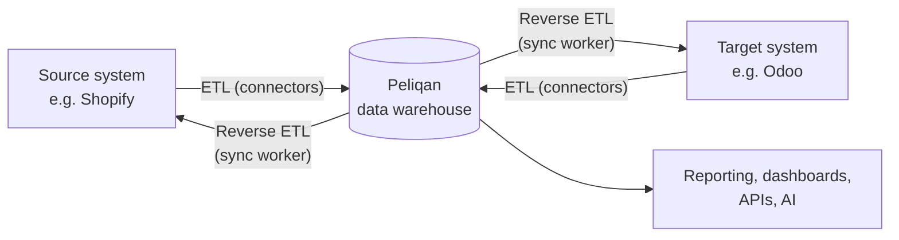
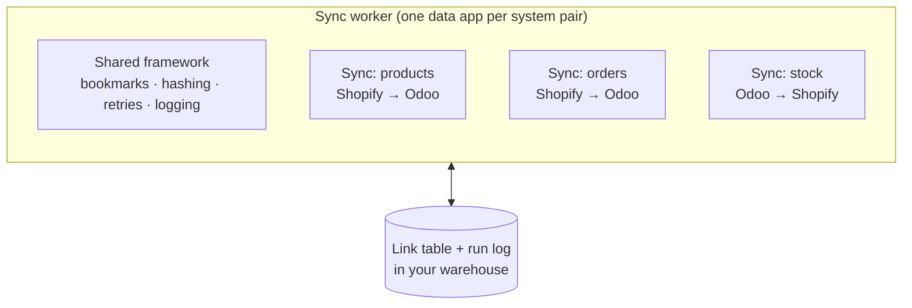

# Peliqan Skills

Skills that let Claude build on your [Peliqan](https://peliqan.io) account for you, with the same patterns our own team uses in production.

| Skill | What it does |
|---|---|
| [`peliqan-sync`](skills/peliqan-sync) | Builds and extends **Reverse ETL sync workers** between two business systems (for example Shopify ⇄ Odoo) as one Peliqan data app. Use it to set up a worker for a system pair, or to add a sync (orders, stock, customers, fulfilment, refunds…) to a worker you already have. |

More skills will be added here over time.

**On this page**

1. [Data syncs in Peliqan: how we approach them](#1-data-syncs-in-peliqan-how-we-approach-them)
2. [Reverse ETL apps: when, why and how](#2-reverse-etl-apps-when-why-and-how)
3. [Building a sync data app with the skill](#3-building-a-sync-data-app-with-the-skill)
4. [Installation](#4-installation)
5. [Repository layout](#5-repository-layout)

---

## 1. Data syncs in Peliqan: how we approach them

Most integration tools connect systems **point to point**: Shopify talks to Odoo directly, Odoo talks to the CRM directly, and so on. That works for the first link. By the fifth, nobody can tell you what was synced, when, or why a record is missing.

Peliqan puts the **data warehouse in the middle**:



- **ETL**: Peliqan's connectors load data from your systems into the warehouse. This is configured, not coded.
- **Reverse ETL**: a sync worker reads from the warehouse and writes records **back** into a business system, such as creating a sales order in Odoo for each new Shopify order.

Every sync we build follows these principles:

| Principle | What it means for you |
|---|---|
| **The warehouse is the hub** | All data and all sync state live in one place. The same data feeds your syncs, your reporting and your APIs. |
| **Every write is traceable** | Each record written to a target is logged in a *link table*: which source record, which target record, when, and with what result. You can always answer "where did this order go?" with SQL. |
| **Idempotent by design** | Running a sync twice never creates duplicates. A record is only rewritten when the fields it owns have actually changed. |
| **Nothing gets lost silently** | Incremental reads use safe bookmarks, failed records are retried, and records that keep failing are parked in a dead-letter view instead of disappearing. |
| **One record never stops the run** | An error on one order is recorded and the run carries on with the next one. |
| **You own the code** | A worker is one readable Python script in your own account, not a black box. You can review, change and extend it. |

---

## 2. Reverse ETL apps: when, why and how

### When to use one

A Reverse ETL app fits when **a business process crosses two systems** and records need to be created or updated in the target automatically.

| Good fit | Typical examples |
|---|---|
| Transactions that must be created in another system | Shopify orders → Odoo sales orders, refunds → credit notes |
| Master data that must stay aligned | Products, prices, customers, addresses |
| Operational status that flows back | Stock levels from the ERP to the webshop, fulfilment and tracking info |
| Logic that a standard connector can't express | Custom field mappings, tax rules, parent/child dependencies, branching on a status |

When something else is the better choice:

- **You only need reporting or analysis.** Data loaded into the warehouse is already queryable; build a dashboard or query table instead.
- **It's a one-off migration or export.** A script or a CSV export is simpler.
- **You need sub-second, event-by-event reactions.** A sync worker runs on a schedule (for example every 5 or 15 minutes). That suits almost all business processes, but not true real-time use cases.

### Why build it on Peliqan

- **The data is already there.** Your connectors have loaded the source data into the warehouse, so the worker reads clean tables instead of calling APIs over and over.
- **Full transparency.** The link table, run log and monitoring views are plain warehouse tables. You can query them, put them on a dashboard or set alerts on them.
- **Safe to rerun.** Because syncs are idempotent, a rerun after an incident is a normal action, not a risk.
- **Built-in error handling.** Retries, dead-lettering and per-record error details come with the framework. You don't rebuild them for every sync.
- **One worker per system pair.** All syncs between two systems live in one app, run in the right order (parents before children) and share the same reliability framework.

### How it works

A **worker** is one Peliqan data app per system pair (for example `shopify_odoo`). It contains a shared framework and one or more **syncs**. Each sync moves one kind of object in one direction.



On every run, each sync:

1. **Reads only what changed** since its last bookmark.
2. For each record:
   1. **Validates** the source record.
   2. **Looks up** in the link table whether it already exists in the target (update) or not (create).
   3. **Maps** the fields and computes a fingerprint (hash) of the fields this sync owns. If nothing changed, it **skips** the record.
   4. **Writes** to the target system.
   5. **Checks the response**, including errors that some APIs hide inside a "successful" reply.
   6. **Logs the outcome** in the link table: `ok`, or an error status with the details.
3. **Moves the bookmark forward**, but only past records that were actually processed.

Records that fail are retried on the next runs. After a set number of attempts they're marked `dead` and show up in the dead-letter view for someone to look at.

Each worker creates these objects in your warehouse:

| Object | Use it to |
|---|---|
| `link_<pair>` | Look up any source record and see which target record it became, and the history of every write |
| `runs_<pair>` | See every run: when, which sync, how many records were processed, skipped or failed |
| `v_dead_letter_<pair>` | List the records that need human attention |
| `v_run_summary_<pair>` | Get a quick health overview per sync |

---

## 3. Building a sync data app with the skill

The `peliqan-sync` skill teaches Claude how to build these workers the way we build them for customers. It includes the framework contract, a worker template, verified notes per system and an offline test. Claude talks to your account through the **Peliqan MCP server**, so it can inspect your connections and tables, deploy the data app and read the run logs.

### What you need

- A Peliqan account with a **connection for both systems** (for example Shopify and Odoo), with their data loaded into the warehouse.
- **Claude** (Claude Code, or claude.ai / Claude Desktop) with this skill installed (see [Installation](#4-installation)).
- The **Peliqan MCP server** connected to Claude: `https://mcp.eu.peliqan.io/mcp`. You sign in with your own Peliqan account the first time it's used.

### Two ways to use it

**1. Set up a worker for a new system pair**

> Build a sync worker between Shopify and Odoo.

Claude checks your account for existing workers, connections and tables, then builds an *empty* worker that contains only the framework, ready for syncs.

**2. Add a sync to an existing worker**

> Add an order sync from Shopify to Odoo: sales order with order lines, customer as partner.

Claude adds that one sync to your existing worker.

You can also ask for both at once ("set up the product and order sync between Shopify and Odoo"). Claude will then ask which syncs you want and how to run the first test safely. You can also call the skill explicitly with `/peliqan-sync`.

### What Claude does, step by step

1. **Inspects your account** first: connection names, existing data apps, the warehouse schema and a few sample rows. That answers most questions before it asks you anything.
2. **Probes the target system** for the modules and fields a sync depends on, so it doesn't build a sync on a field that doesn't exist.
3. **Asks for the sync specification**: direction, field mapping, which system owns which fields, dependencies. You can paste a row from your requirements matrix.
4. **Writes and tests the code locally**: a compile check, a lint check, the bookmark test and a simulated run against fake systems, before anything touches your data.
5. **Deploys the data app** to your account and verifies that what's deployed matches what was tested.
6. **Runs a limited first test** (`TEST_LIMIT`) and reads the logs.
7. **Runs a second time to prove idempotence**: no new writes, only "no change, skip".
8. **Hands over** with a list of the design decisions taken (taxes, draft vs. confirmed, variants, locations…) for you to review.

Scheduling the worker and lifting the test limit stay **your decision**. Claude doesn't do that for you.

### Supported systems

| System | Status |
|---|---|
| Shopify | Verified in production |
| Odoo | Verified in production |
| Other systems (Salesforce, SAP, Klaviyo, …) | Supported through a checklist. Claude works through it with you and records the answers in a new system file before building. It never guesses how an API behaves. |

### Safety rules built into the skill

- **A run is a write.** Claude never runs a worker against a live target just to see what happens. It tests with a record limit, a sandbox copy or by reading the link table.
- **Test with realistic data.** A dummy order without discounts, shipping or deviating taxes doesn't test those mappings, so the skill seeds proper test records first.
- **Sandbox = a separate copy.** A test copy of a worker gets its own link table and bookmarks, so it can never duplicate records into your live system.
- **Nothing is deleted** unless you ask for it explicitly.

### What to expect

Adding a sync is real development work, typically about three functions of code. It is not a configuration toggle. What the skill gives you is that every sync automatically gets duplicate protection, change detection, retries, error logging and safe bookmarks, so the effort goes into your business logic instead of plumbing.

---

## 4. Installation

### Claude Code

Copy the skill into your personal (or project) skills folder:

```bash
git clone https://github.com/Peliqan-io/skills.git peliqan-skills
mkdir -p ~/.claude/skills
cp -R peliqan-skills/skills/peliqan-sync ~/.claude/skills/
```

Then add the Peliqan MCP server:

```bash
claude mcp add --transport http peliqan https://mcp.eu.peliqan.io/mcp
```

### claude.ai / Claude Desktop

1. Download the `skills/peliqan-sync` folder and zip it (the zip must contain the `peliqan-sync` folder).
2. Go to **Settings → Capabilities → Skills** and upload the zip.
3. Add the Peliqan MCP server as a custom connector: `https://mcp.eu.peliqan.io/mcp`.

---

## 5. Repository layout

```
skills/
└── peliqan-sync/
    ├── SKILL.md                     # entry point: when and how Claude uses the skill
    ├── references/
    │   ├── framework-contract.md    # the rules every worker and sync follows
    │   ├── worker-build.md          # workflow: set up a worker for a system pair
    │   ├── sync-build.md            # workflow: add one sync to a worker
    │   └── systems/                 # verified notes per system + checklist for new ones
    ├── assets/
    │   ├── worker_template.py       # the framework template
    │   └── sync_examples/           # reference syncs from a live worker
    └── scripts/
        └── test_bookmarks.py        # offline test of the bookmark rules
```

---

Questions or want help setting up your first sync? Get in touch with your Peliqan contact.
