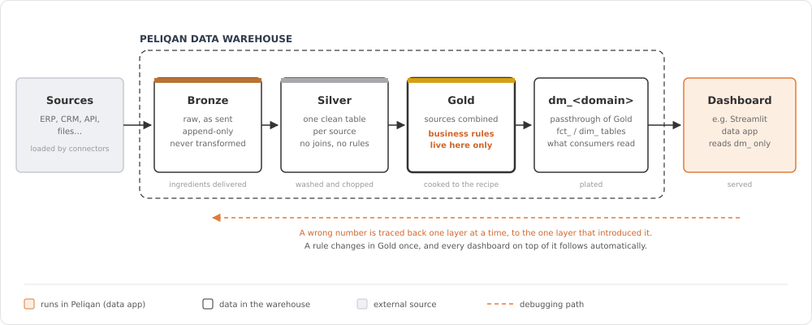
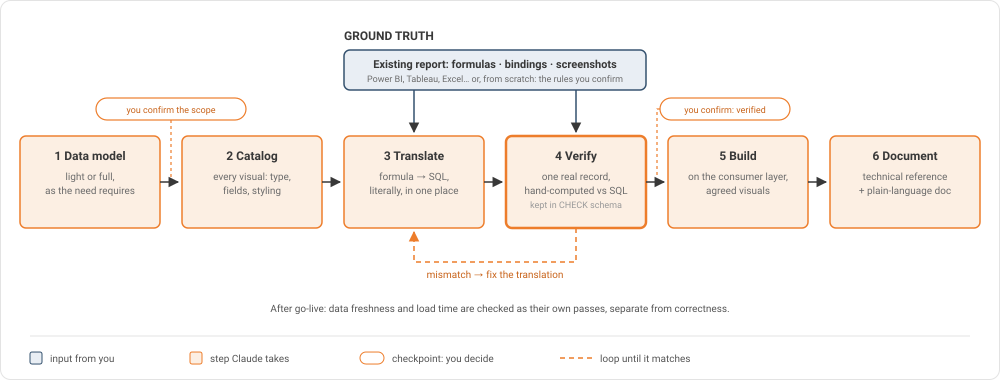

# Dashboards

Dashboards on a layered (medallion) data architecture in your Peliqan warehouse. Rebuild an existing Power BI report with its own DAX as the ground truth, or build a new one from scratch. Claude verifies every number on real records before it builds anything on top of it.

| | |
|---|---|
| **Build skill** | [`peliqan-dashboard`](../../skills/peliqan-dashboard) |
| **Audit** | [`peliqan-audit`](../../skills/peliqan-audit) → `references/dashboard.md` |
| **Support** | [`peliqan-support`](../../skills/peliqan-support) → `references/dashboard.md` |

**On this page**

1. [What it is](#1-what-it-is)
2. [When to use it](#2-when-to-use-it)
3. [How it works](#3-how-it-works)
4. [Using the skills](#4-using-the-skills)

---

## 1. What it is

Your data moves through four layers in the warehouse, each with exactly one job. The dashboard is a Peliqan data app (for example Streamlit) that reads only from the last layer.

  

| Layer | Job | Think of it as |
|---|---|---|
| **Bronze** | Raw data exactly as the source sends it. Append-only, never transformed. | Ingredients delivered |
| **Silver** | One cleaned, deduplicated, typed table per source. No joins, no business rules. | Washed and chopped |
| **Gold** | Sources combined, and **every business rule lives here and only here**: what counts as revenue, how an amount is derived, how a status code becomes a label. | Cooked to the recipe |
| **`dm_<domain>`** | A passthrough of Gold, shaped for its consumers (`fct_` / `dim_` tables). No new logic. | Plated |

Every dashboard follows these principles:

| Principle | What it means for you |
|---|---|
| **One place for every rule** | A formula exists once, in Gold. Change it there and every dashboard on top follows. |
| **Parity before polish** | When rebuilding a report, the original DAX decides what's correct, even where it looks unconventional. |
| **Verified, not assumed** | A query that runs isn't done. Each number is checked on a real record against the source report, and the checks are kept. |
| **Same look, not just same numbers** | Visual types, colours and hierarchies are replicated, not swapped for "close enough". |
| **Traceable** | A wrong number is found one layer at a time, at the one layer that introduced it. |
| **Two documents** | A technical reference for whoever maintains it, and a plain-language one for whoever signs off on the assumptions. |

---

## 2. When to use it

| Good fit | Typical examples |
|---|---|
| Moving off Power BI (or a similar BI tool) | Rebuild a report page as a dashboard on your own warehouse, with matching numbers |
| A new reporting domain | Set up Bronze/Silver/Gold/`dm_` for sales, finance or projects, with a dashboard on top |
| Checking numbers | "Does our dashboard still match the Power BI report?" |
| One source of truth for several consumers | The same `dm_` tables feeding a dashboard, an API endpoint and exports |

When something else is the better choice:

- **A quick one-off chart.** Query the table directly; you don't need four layers for it.
- **Writing data back to an app.** That's a [sync](../syncs/README.md), not a dashboard.

### Before / after

You have a Power BI sales report and want it as a dashboard on your Peliqan warehouse.

**Without the skill:** someone rewrites the measures in SQL from memory of what they *should* be, the totals are 3% off, and nobody can say which of twenty formulas is responsible.

**With the skill:**

> Rebuild the "Sales overview" page of this PBIX as a dashboard.

Claude sets up the layers, catalogs every visual on that page, translates each DAX measure literally into Gold, checks it on one real record against the report, and only then builds the dashboard. Every check is kept in a `CHECK` schema, so "how do we know this is right?" always has an answer.

---

## 3. How it works

  

1. **Layers first.** Bronze → Silver → Gold → `dm_`, following the naming your warehouse already uses.
2. **Catalog the page.** With a PBIX, you confirm which page to rebuild. Claude records every visual's type, fields and styling, and checks that the data behind it exists in the warehouse.
3. **Translate literally.** Each DAX measure becomes SQL in Gold, including its sign conventions, filters and scopes, even when two related measures look inconsistent. That inconsistency may be intentional.
4. **Verify on one real record.** Claude picks a record you can check in the report, hand-computes what the DAX produces, and compares it with the SQL output, field by field. A mismatch goes back to step 3. Checks are kept in a `CHECK` schema.
5. **Build** the dashboard on the `dm_` layer, with the same visual types as the original. This happens only after you confirm the numbers are verified.
6. **Document** in two versions: technical (SQL, field mappings, DAX comparisons) and plain language (no code).

**No PBIX?** Then there's nothing to verify against. Claude asks you for the business rules, or proposes standard definitions and states them as assumptions for you to confirm. Steps 1, 5 and 6 work the same.

After go-live, **freshness** and **load time** are checked as their own passes. A green pipeline doesn't guarantee every row is current, and a correct dashboard can still be slow.

---

## 4. Using the skills

### What you need

- A Peliqan account with the **source data loaded** into the warehouse by connectors.
- Optionally: the **PBIX file**, the **DAX measures** (pasted from Power BI's model view) and **screenshots** of the rendered page.
- **Claude** with the Peliqan skills installed and the Peliqan MCP connected. See [Installation](../../README.md#installation).

### Build: `peliqan-dashboard`

> Rebuild this Power BI report as a dashboard.

> Set up bronze, silver and gold for our project data, with a dashboard on top.

Claude previews the stages, then checks in at fixed points: which page, whether a formula's result is confirmed, and whether to move from verifying to building. It also asks before assuming a title or a logo.

### Audit: `peliqan-audit`

> Check our sales dashboard before we switch off Power BI.

Claude checks the architecture, correctness and presentation:
- **Architecture:** business rules only in Gold, `dm_` tables as pure passthroughs, and the dashboard reading `dm_` only.
- **Correctness**, when a PBIX or DAX is available: the field bindings and the known DAX translation traps.
- **Presentation:** visual types, number formatting and column names.
- **Health:** data freshness and load time.

You get the same verdict, scorecard and fix list as for any audit.

### Support: `peliqan-support`

> The dashboard numbers don't match Power BI anymore.

Claude first settles two questions:
- Is it **dashboard-side or warehouse-side**?
- Is the data **stale** (stopped updating) or **wrong** (current but different)?

It then follows lineage down the layers, or isolates one record, to find the layer where the value first diverges. If the cause is stale data, it stops at the diagnosis and never triggers a resync itself.

### Safety rules built into the skills

- **The original report is the ground truth.** Claude doesn't "fix" a DAX measure that looks unconventional; it asks.
- **Business rules never go into the dashboard or the `dm_` layer**, not even as a quick fix.
- **Verification queries aren't deleted** without your confirmation.
- **No resyncs, no publishing to other tools.** Documentation is handed to you as files; pushing it to Notion or elsewhere is a separate request.
