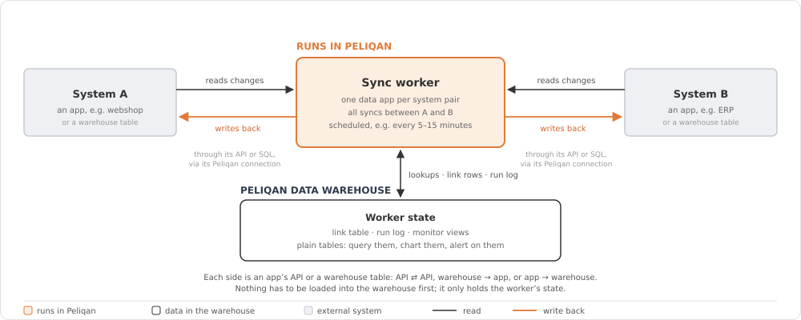
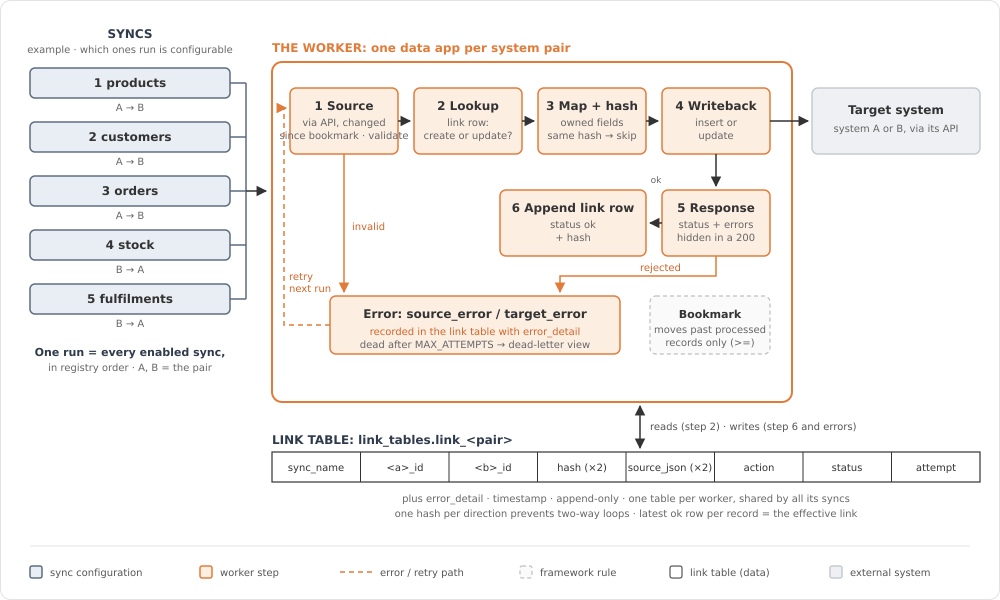

# Syncs

Keep two business systems in sync: orders, stock, customers, fulfilments, refunds… Claude builds the sync on a proven framework, deploys it as a data app on your Peliqan account, and checks it before and after go-live.

| | |
|---|---|
| **Build skill** | [`peliqan-sync`](../../skills/peliqan-sync) |
| **Audit** | [`peliqan-audit`](../../skills/peliqan-audit) → `references/sync.md` |
| **Support** | [`peliqan-support`](../../skills/peliqan-support) → `references/sync.md` |
| **Deep dive** | [Technical overview](technical-overview.md): requirements, risks and guards, QA |

**On this page**

1. [What it is](#1-what-it-is)
2. [When to use it](#2-when-to-use-it)
3. [How it works](#3-how-it-works)
4. [Using the skills](#4-using-the-skills)

---

## 1. What it is

A **sync worker** is one Peliqan data app per system pair. It reads changed records on one side and writes them to the other, in either direction. Each side is an app's API or a table in your warehouse, so API ⇄ API, warehouse → app and app → warehouse all work. Nothing has to be loaded into the warehouse first. The warehouse only holds the worker's state.

  

Every worker follows these principles:

| Principle | What it means for you |
|---|---|
| **Every write is traceable** | Each record written to a target is logged in a *link table*: which source record, which target record, when, and with what result. You can always answer "where did this order go?" with SQL. |
| **Idempotent by design** | Running a sync twice never creates duplicates. A record is only rewritten when the fields it owns have actually changed. |
| **Nothing gets lost silently** | Incremental reads use safe bookmarks, failed records are retried, and records that keep failing are parked in a dead-letter view instead of disappearing. |
| **One record never stops the run** | An error on one order is recorded and the run carries on with the next one. |
| **State lives next to your data** | The link table, run log and monitor views are plain warehouse tables. Query them, chart them, alert on them. |
| **You own the code** | A worker is one readable Python script in your own account, not a black box. You can review, change and extend it. |

---

## 2. When to use it

| Good fit | Typical examples |
|---|---|
| Transactions that must be created in another system | Webshop orders → sales orders in the ERP, refunds → credit notes |
| Master data that must stay aligned | Products, prices, customers, addresses |
| Operational status that flows back | Stock levels from the ERP to the webshop, fulfilment and tracking info |
| Warehouse data that must reach an app, or the other way | A cleaned customer table → the CRM; app records → a warehouse table |
| Logic that a standard connector can't express | Custom field mappings, tax rules, parent/child dependencies, branching on a status |

When something else is the better choice:

- **You only need reporting or analysis.** Load the data with a connector and build on the warehouse instead.
- **It's a one-off migration or export.** A script or a CSV export is simpler.
- **You need sub-second, event-by-event reactions.** A worker runs on a schedule (for example every 5 or 15 minutes). That suits almost all business processes, but not true real-time use cases.

### Before / after

You want every new webshop order to show up in your ERP as a sales order.

**Without the skill:** someone writes API calls, invents their own way to remember what was already sent, finds the duplicates a week later and wonders why three orders never arrived.

**With the skill:**

> Add an order sync from the webshop to the ERP: sales order with order lines, customer as contact.

Claude inspects your account, writes the sync on the framework, tests it offline, deploys it, runs a limited test and proves on a second run that nothing gets written twice. Every order it touches is traceable in your warehouse.

---

## 3. How it works

A worker contains a shared framework and one or more **syncs**. Each sync moves one kind of object in one direction. On every run, the enabled syncs run in registry order (parents first), and each sync:

1. **Reads only what changed** since its last bookmark.
2. For each record:
   1. **Validates** the source record.
   2. **Looks up** in the link table whether it already exists in the target (update) or not (create).
   3. **Maps** the fields and computes a fingerprint (hash) of the fields this sync owns. If nothing changed, it **skips** the record.
   4. **Writes** to the target.
   5. **Checks the response**, including errors that some APIs hide inside a "successful" reply.
   6. **Logs the outcome** in the link table: `ok`, or an error status with the details.
3. **Moves the bookmark forward**, but only past records that were actually processed.

  

Records that fail are retried on the next runs. After a set number of attempts they're marked `dead` and show up in the dead-letter view for someone to look at.

Each worker creates these objects in your warehouse:

| Object | Use it to |
|---|---|
| `link_<pair>` | Look up any source record and see which target record it became, and the history of every write |
| `runs_<pair>` | See every run: when, which sync, how many records were processed, skipped or failed |
| `v_dead_letter_<pair>` | List the records that need human attention |
| `v_run_summary_<pair>` | Get a quick health overview per sync |

---

## 4. Using the skills

### What you need

- A Peliqan account with a **connection for each app** the worker talks to (or the warehouse table it reads or writes).
- **Claude** with the Peliqan skills installed and the Peliqan MCP connected. See [Installation](../../README.md#installation).

### Build: `peliqan-sync`

**Set up a worker for a new system pair**

> Build a sync worker between our webshop and our ERP.

Claude checks your account for existing workers, connections and tables, then builds an *empty* worker that contains only the framework, ready for syncs.

**Add a sync to an existing worker**

> Add an order sync from the webshop to the ERP: sales order with order lines, customer as contact.

You can also ask for both at once ("set up the product and order sync between the webshop and the ERP"). Claude will then ask which syncs you want and how to run the first test safely.

What Claude does, step by step:

1. **Inspects your account** first: connection names, existing data apps, the warehouse schema and a few sample rows. That answers most questions before it asks you anything.
2. **Probes the target** for the modules and fields a sync depends on, so it doesn't build a sync on a field that doesn't exist.
3. **Asks for the sync specification**: direction, field mapping, which system owns which fields, dependencies. You can paste a row from your requirements matrix.
4. **Writes and tests the code locally**: a compile check, a lint check, the bookmark test and a simulated run against fake systems, before anything touches your data.
5. **Deploys the data app** to your account and verifies that what's deployed matches what was tested.
6. **Runs a limited first test** (`TEST_LIMIT`) and reads the logs.
7. **Runs a second time to prove idempotence**: no new writes, only "no change, skip".
8. **Hands over** with a list of the design decisions taken (taxes, draft vs. confirmed, variants, locations…) for you to review.

Scheduling the worker and lifting the test limit stay **your decision**.

Adding a sync is real development work, typically about three functions of code, not a configuration toggle. What the framework gives you is that every sync automatically gets duplicate protection, change detection, retries, error logging and safe bookmarks, so the effort goes into your business logic instead of plumbing.

### Audit: `peliqan-audit`

> Audit our order sync. Can we go live?

Claude reads the worker's code, configuration and recent runs, and scores them against the framework rules: safe bookmarks, duplicate protection, error handling, leftover test settings, growing error counts, duplicates in the link table. You get a verdict (**ready**, **ready with warnings**, **not ready**), a scorecard with evidence for every check and a fix list ranked by impact. The audit never changes anything.

### Support: `peliqan-support`

> Orders stopped arriving in the ERP since Tuesday.

Claude finds the worker, compares the last good run with the first bad one, queries the link table for the affected records and matches the symptom to a known cause. You get the evidence, the root cause and a concrete fix. Replaying records, rewinding a bookmark or redeploying only happens after you say yes.

### Supported systems

| System | Status |
|---|---|
| Shopify | Verified in production |
| Odoo | Verified in production |
| Peliqan warehouse tables | Supported as source or target |
| Other apps (Salesforce, SAP, Klaviyo, …) | Supported through a checklist. Claude works through it with you and records the answers in a new system file before building. It never guesses how an API behaves. |

### Safety rules built into the skills

- **A run is a write.** Claude never runs a worker against a live target just to see what happens. It tests with a record limit, a sandbox copy or by reading the link table.
- **Test with realistic data.** A dummy order without discounts, shipping or deviating taxes doesn't test those mappings, so the skill seeds proper test records first.
- **Sandbox = a separate copy.** A test copy of a worker gets its own link table and bookmarks, so it can never duplicate records into your live system.
- **Nothing is deleted** unless you ask for it explicitly.
