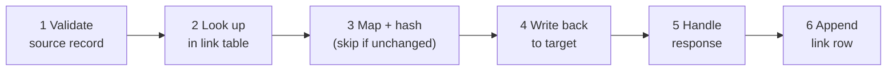

# Sync workers: technical overview

How a Peliqan sync worker built with these skills is put together, what a run does, what your account needs, which risks the framework guards against, and how it is tested.

For the short version, see the [README](../README.md).

---

## 1. What a worker is

A **worker** is one Peliqan data app per system pair, for example Shopify ⇄ Odoo. It runs every sync between those two systems, and keeps its state in your data warehouse.

| Part | What it holds |
|---|---|
| **System A**, e.g. Shopify | Read and written through its Peliqan connection (GraphQL for Shopify). Products, variants, customers, orders… |
| **System B**, e.g. Odoo | Read and written through its Peliqan connection (RPC for Odoo). `product.template`, `product.product`, `res.partner`, `sale.order`, `stock.picking`… |
| **Data warehouse** | The worker's state, in schema `link_tables`: the link table, the run log and the monitor views. The worker creates and registers these itself. |

Every processed record leaves a row in the **link table** with a hash of the fields the sync owns. On the next run, unchanged records are skipped instead of written again. That link table is the backbone of the whole design: it is what makes every run idempotent.

---

## 2. One run, step by step

A run walks through the enabled syncs in registry order: parents before children, so products before orders. Inside a sync, every record follows the same six steps. A failed write lands in the link table as `target_error` and does not stop the run.

| Step | What happens | On failure |
|---|---|---|
| 1. Validate | Required fields present, record usable | `source_error` row |
| 2. Look up | Link table says: create or update, and what the last hash was | — |
| 3. Map + hash | Fields mapped; hash over the owned fields. Same hash → skip | — |
| 4. Write back | One target record per call | — |
| 5. Handle response | Checks the status **and** functional errors hidden in a successful reply (Shopify `userErrors`, an Odoo fault in a 200) | `target_error` row |
| 6. Append link row | `ok` plus the hash, or the error with its details | retried next run, `dead` after `MAX_ATTEMPTS` |

The bookmark of a sync only moves past records that were actually processed. Incremental reads use `>=` on the change timestamp, because many records can share the same second. A strict `>` would permanently skip the rest of such a cluster after an interrupted run.

---

## 3. What your account needs

| Requirement | Why |
|---|---|
| **Connections with the exact names the worker uses** (for example `Shopify V2` and `Odoo`) | The worker connects at start-up. A different name crashes the app before the first sync starts. |
| **Write access in the target system**, not just read access | Read-only access proves nothing about writes. If the worker creates custom fields in Odoo (`ir.model.fields`), that user must be allowed to. |
| **Both systems' data loaded into the warehouse** | The worker reads changed records from the warehouse tables. |
| **The Peliqan MCP connected to Claude** | So the skills can inspect the account, deploy and read run logs. |

> **Verify custom fields after the first run.** If the worker creates custom fields and lacks the permission, the creation fails with only a warning, the run stays green and the mappings to those fields write nothing. Check that the fields exist after the first run.

---

## 4. The staged first run

A first run is a write to two live systems, so it is staged:

1. **`TEST_LIMIT` low (e.g. 5), one sync enabled** in `SYNCS_ENABLED`.
2. Check the link table and the target system: are the records right?
3. **Run again.** It must write nothing: only "no change in hash → skip" or "already linked". That is the idempotence proof.
4. Enable the next sync, one at a time.
5. Then lift `TEST_LIMIT` and schedule the worker. That step stays your decision.

---

## 5. Risks and the guards that catch them

Most rules here come from a real incident. A guard without a story behind it tends to get removed sooner or later.

| Risk | What goes wrong | Guard |
|---|---|---|
| **Unregistered link table** | Raw DDL creates the Postgres table without registering it in Peliqan's catalog. Writes to the target land, link rows don't: silent duplicates on every run, with a green run. | `ensure_schema` creates, registers and verifies the tables, and aborts the run if that fails. No sync runs on an unverified link table. |
| **Strict `>` bookmark** | An interrupted run sets the bookmark to a second that more records share. The rest of them are never picked up. | Incremental reads use `>=`. The re-read boundary records are absorbed by hash-skip. `test_bookmarks.py` proves it offline. |
| **Changing what a sync owns** | Adding a field to the hash changes the hash of every record, so the next run rewrites the whole catalogue in the target. | Treated as a deliberate re-drive: stated up front, with a procedure (reset bookmark, run, verify counts). |
| **Two apps on one pair name** | Two workers sharing one link table each see the other's hashes as changed, and rewrite everything. | One writer per pair. A sandbox copy gets its own `PAIR`, so its own link table and bookmarks. |
| **Successful write, failed link row** | The target record exists but the link table doesn't know it: a duplicate on the next run. | Three retries on the link-row insert, plus an error-row fallback. |
| **Running the worker to "just try it"** | Every run writes to live systems. | Test with `TEST_LIMIT`, a sandbox copy or by reading the link table. The skills never run a worker against a live target unasked. |

---

## 6. QA: offline first, then live

| Layer | When | What it checks |
|---|---|---|
| **Offline checks** | Before every deploy | The script compiles and lints clean. `test_bookmarks.py` proves the bookmark rules. A simulated run against fake systems: run 1 creates, run 2 writes nothing, run 3 propagates exactly one change. |
| **Deploy check** | After every deploy | The deployed script is read back and compared with what was tested. |
| **Live, staged** | First run and after changes | The staged first run from §4, on realistic seeded test data (orders with discounts, shipping and deviating taxes, not one bare order line). |
| **Audit** | Before go-live, then periodically | `peliqan-sync-audit`: scorecard against the framework rules and the run history. |

**What tests cannot guard:** write permissions in the target, whether the field mappings are right for *your* business, and the cost of a full re-drive. A matching deploy check proves the right code arrived, not that it runs. That's what the staged first run and the audit are for.

---

## 7. Monitoring

Every worker creates these in your warehouse:

| Object | Use it for |
|---|---|
| `link_<pair>` | Any source record → its target record, plus the full history of every write |
| `runs_<pair>` | Every run: when, which sync, processed / skipped / failed |
| `v_run_summary_<pair>` | Health per sync at a glance |
| `v_dead_letter_<pair>` | Records that stopped retrying and need a person |

They are plain warehouse tables: query them, put them on a dashboard, or alert on them.
